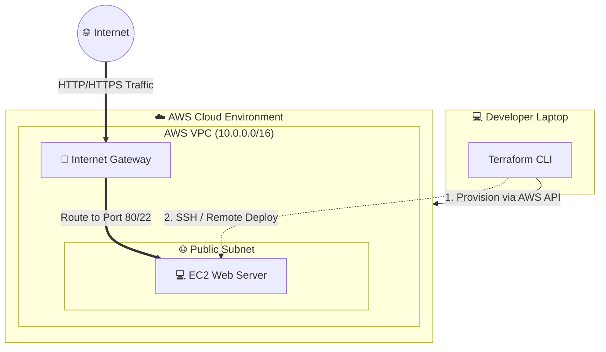

# BOBOBOX TAKE HOME ASSIGNMENT

# TASK 1 : Server health check automation

This repo contains `health_check.sh`, a Bash script designed to automate basic server health monitoring. It performs connectivity checks, verifies web service availability, and reports the root filesystem's disk usage. All results are logged with timestamps for auditing purposes.

## Prerequisites
Ensure the environment running this script has the following standard Linux utilities installed:
- `bash`
- `ping`
- `curl`
- `df`

## Usage
The script requires at least one argument (Target IP/Hostname). The port argument is optional and defaults to `80` if not provided.

**Syntax:**
`./health_check.sh <IP_or_Hostname> [port]`

**Make the script executable first:**
`chmod +x health_check.sh`

**Examples:**
1. Running with a specific port (Example output as requested):
   `./health_check.sh localhost 80`
   
2. Running without a port (will default to port 80):
   `./health_check.sh 10.20.30.40`

3. Handling missing arguments:
   `./health_check.sh`
   *(Will output usage instructions and exit with status 1)*

## Output & Logging
When executed, the script outputs the results to the standard output (console) and simultaneously appends the results with a timestamp to `health_check.log` in the same directory.

## Architecture & Reasoning Decisions
As part of the assignment requirements to provide reasoning, here are the key technical decisions made for this script:

1. **Local vs. Remote Disk Usage (`df -h /`):** While `ping` and `curl` test network availability remotely, the `df -h /` command inspects the local machine's filesystem. I deliberately kept this as a local execution instead of wrapping it in an SSH command (`ssh user@target "df -h /"`). 
   *Reasoning:* The assignment does not provide SSH credentials or key paths, and the example execution uses `localhost`. Therefore, the script is designed with the assumption that it will be executed *locally* on the target server (e.g., triggered by a cron job) or used locally by an agent before sending metrics to a centralized monitoring system like Zabbix or Prometheus.
   
2. **Error Handling & Exit Codes:**
   If the target is unreachable via `ping`, the script immediately logs the failure and exits with a non-zero status (`exit 1`). This ensures the script is CI/CD pipeline-friendly and can be easily caught by external automation tools.

3. **Port Variable Fallback:**
   Used the bash parameter expansion `PORT=${2:-80}` to cleanly assign a default value without requiring complex `if-else` blocks, keeping the script lightweight and readable.


# TASK 2: Next.js Dockerization

## Overview
This section contains the containerization of a Next.js application. The implementation focuses on creating a highly optimized, lightweight, and production-ready Docker image using a Multi-stage build.

## Prerequisites
- Docker Engine
- Docker Compose

## Directory Structure
```text
.
├── app/
│   ├── pages/
│   │   └── index.js
│   ├── next.config.js
│   └── package.json
├── docker-compose.yml
├── Dockerfile
└── README.md
```

## How to Run
1. Navigate to the project directory containing the `docker-compose.yml` file.
2. Build and start the container in detached mode:
   ```bash
   docker compose up -d --build
   ```
3. Open web browser and access the application at:
   **http://localhost:8080**
   *(You should see the "Hello, Docker!" heading).*

4. To stop the container:
   ```bash
   docker compose down
   ```

## Architecture & Reasoning Decisions

The following technical decisions were made:

1. **Multi-stage Build & Alpine Image (`node:20-alpine`)**
   The `Dockerfile` is separated into three stages: `deps`, `builder`, and `runner`. 
   *Reasoning:* This prevents development dependencies, source code, and NPM cache from bloating the final production image. Node 20 is used to satisfy the requirements of the latest Next.js version.

2. **Next.js Standalone Mode (`next.config.js`)**
   The configuration `output: 'standalone'` was explicitly added to Next.js.
   *Reasoning:* By default, Next.js requires the heavy `node_modules` folder to run. The standalone mode intelligently traces imports and copies only the necessary files into a `.next/standalone` folder to reduces the final image size.

3. **Docker Compose Configuration**
   - **Port Mapping (`8080:3000`):** The application runs on port 3000 inside the container, but is mapped to port 8080 on the host machine.
   - **Restart Policy (`unless-stopped`):** If the application crashes or the host server restarts, Docker will automatically bring the container back online.
   - **Environment Variable (`NODE_ENV=production`):** Enforces Next.js to run in production mode.

# TASK 3: Infrastructure as Code (IaC) with OpenTofu

## Overview
This repository contains an Infrastructure as Code (IaC) implementation using **OpenTofu**

## Topology & Network Diagram



## Prerequisites
1. **OpenTofu** (`tofu` CLI) installed.
2. **AWS CLI** configured with appropriate IAM permissions.
3. S3 Bucket and DynamoDB table to initialize the remote backend for state locking.

## Implementation & How-To Notes

### Step 1: Authentication & Setup
Ensure AWS CLI is authenticated and configured. Open terminal and run:
```bash
aws configure
```
*(Provide AWS Access Key, Secret Key, and set the default region, e.g., `ap-southeast-1`)*

### Step 2: Install OpenTofu
Download the official installer
```
curl --proto '=https' --tlsv1.2 -fsSL https://get.opentofu.org/install-opentofu.sh -o install-opentofu.sh
```

grant execution permission
```
chmod +x install-opentofu.sh
```

Run the script to setup the repository for Debian/Ubuntu
```
./install-opentofu.sh --install-method deb
```

Install OpenTofu
```
sudo apt-get update && sudo apt-get install -y tofu
```

### Step 3: Initialize OpenTofu
Initialize the working directory. This step downloads the required AWS provider plugins and configures the remote state backend.
the Terraform State is configured to be stored remotely in an **AWS S3 Bucket** with state locking via **DynamoDB**. This prevents sensitive infrastructure data and state files from being exposed in local plaintext
```bash
tofu init
```
when the remote state backend has successful, the output look like this
```
Initializing the backend...

Successfully configured the backend "s3"! OpenTofu will automatically
use this backend unless the backend configuration changes.
```

### Step 4: Validate and Plan Configuration
I prefer use `tofu validate` to validate the code syntax, then use `tofu plan` to preview the infrastructure changes OpenTofu will execute.
```bash
tofu validate
tofu plan
```

### Step 5: Apply and Provision Resources
Deploy the infrastructure to AWS. OpenTofu will prompt confirmation before proceeding.
```bash
tofu apply
```
*(Type `yes` when prompted.).*

### Step 6: Verify the Deployment
Once the deployment is complete, OpenTofu will display the `instance_public_ip` in the terminal output. Verify the web server is running by using `curl` or opening the IP in web browser:
```bash
C:\Users\gngsp>curl 52.221.235.210
<h1>Hello, OpenTofu!</h1>

C:\Users\gngsp>
```

### Step 7: Teardown and Destroy Resources
To prevent ongoing AWS Free Tier charges, safely clean up and destroy all provisioned resources once the evaluation is complete.
```bash
tofu destroy
```
*(Type `yes` when prompted.).*